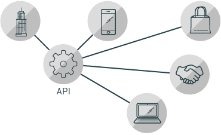

# Le API

Un'API (Application Programming Interface) è un insieme di funzionalità e regole che esistono all'interno di un programma software (l'applicazione) che consente l'interazione con esso tramite il software, al contrario di un'interfaccia utente umana. 

L'API può essere vista come un semplice contratto (l'interfaccia) tra l'applicazione che la offre e altri elementi, come software o hardware di terze parti.

Nello sviluppo Web, un'API è generalmente **un insieme di funzionalità del codice** (ad esempio metodi, proprietà, eventi e URL) che uno sviluppatore può utilizzare nelle proprie app per interagire con i componenti del browser Web di un utente o altro software / hardware sull'utente computer o siti Web e servizi di terze parti.

---

Per esempio:

* L'API **getUserMedia** può essere utilizzata per acquisire audio e video dalla webcam di un utente, che può quindi essere utilizzata in qualsiasi modo piaccia allo sviluppatore, ad esempio registrando video e audio, trasmettendoli a un altro utente in una chiamata in conferenza o catturando immagini fisse dal video.
* L'API di **geolocalizzazione** può essere utilizzata per recuperare le informazioni sulla posizione da qualsiasi servizio l'utente ha a disposizione sul proprio dispositivo (ad es. GPS), che può quindi essere utilizzata insieme alle API di Google Maps per ad esempio tracciare la posizione dell'utente su una mappa personalizzata e mostrare loro quali sono le attrazioni turistiche nella loro zona.
* Le API di **Twitter** possono essere utilizzate per recuperare i dati dagli account Twitter di un utente, ad esempio, per visualizzare i suoi ultimi tweet su una pagina web.
* L'API Web **Animations** può essere utilizzata per animare parti di una pagina Web, ad esempio per far spostare o ruotare le immagini.

---

Le **API** (acronimo di Application Programming Interface, ovvero Interfaccia di programmazione delle applicazioni) sono **set di definizioni** e **protocolli** con i quali vengono **realizzati** e **integrati** software applicativi. 

Consentono ai tuoi prodotti o servizi di **comunicare** con altri prodotti o servizi senza sapere come vengono implementati, semplificando così lo sviluppo delle app e consentendo un netto risparmio di tempo e denaro. Durante la creazione di nuovi strumenti e prodotti o la gestione di quelli esistenti, le **API** offrono flessibilità, semplificano la progettazione, l'amministrazione e l'utilizzo, e garantiscono opportunità di innovazione.

Talvolta vengono concepite come una forma di **contratto**, con una documentazione che rappresenta un accordo tra le parti: se la parte A invia una richiesta remota strutturata in un determinato modo, il software della parte B risponderà in un altro modo determinato.

---

Le **API**, semplificando l'integrazione di nuovi componenti applicativi in un'architettura esistente, promuovono la collaborazione tra azienda e team IT. Per restare competitive e rispondere ai costanti mutamenti dei mercati digitali, in cui nuovi concorrenti possono rivoluzionare un intero settore con una nuova app, le aziende devono adattarsi rapidamente e supportare lo sviluppo e il deployment di servizi innovativi. Lo sviluppo di applicazioni cloud-native, basato sul collegamento di un'architettura applicativa di microservizi attraverso le **API**, consente di accelerare la velocità di sviluppo.

Grazie alle **API** è possibile collegare con facilità l'infrastruttura mediante lo sviluppo di app cloud-native, nonché condividere i dati con i clienti e con altri utenti esterni. Le **API** pubbliche sono estremamente preziose poiché oltre a semplificare ed espandere il modo in cui la tua azienda si collega con i tuoi partner, permettono anche di monetizzare i dati (basti pensare all'**API** di Google Maps).

---

**Esistono tre diversi approcci ai criteri di rilascio delle API.**

### Privato
L'**API** è destinata solo a un utilizzo interno. Questo approccio offre alle aziende un controllo delle **API** ottimale.
### Partner
L'**API** è condivisa tra specifici partner aziendali. Questo approccio può fornire flussi di reddito aggiuntivi, senza compromettere la qualità.
### Pubblico
L'**API** è disponibile a chiunque. Questo approccio consente a terze parti di sviluppare app che interagiscono con l'**API** e che possono rappresentare una fonte di innovazione.

---

## Perché utilizzare le API?
L'esposizione delle **API** ai partner o al pubblico consente di:
* Creare nuovi canali di reddito o espandere quelli esistenti.
* Espandere la copertura del tuo brand.
* Facilitare l'apertura all'innovazione o l'incremento dell'efficienza grazie allo sviluppo e alla collaborazione con l'esterno.
In che modo le **API** riescono a ottenere questi risultati?

## API remote

Le **API** remote sono concepite per interagire tramite una rete di comunicazione. Si chiamano **API** remote perché le risorse gestite dall'**API** sono esterne al computer che invia la richiesta. Poiché il canale di comunicazione più diffusamente utilizzato è Internet, la maggior parte delle **API** è progettata in base a standard web. Non tutte le **API** remote sono **API** web, ma possiamo affermare che le **API** web sono remote.
Queste ultime utilizzano in genere l'**HTTP** per richiedere messaggi e fornire una definizione della struttura dei messaggi di risposta. I messaggi di risposta assumono in genere la forma di file **XML** o **JSON**, due formati diffusi perché presentano i dati in modo da consentire alle altre app di gestirli facilmente.

[API RESTful](005_API_RESTful.md)