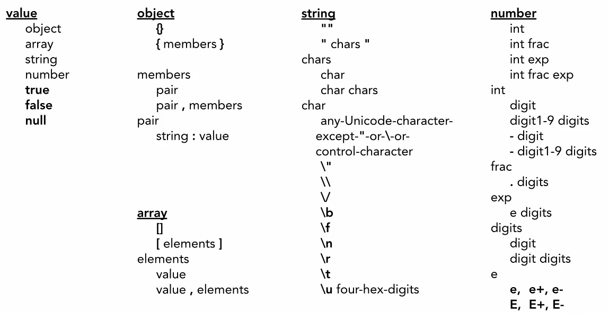

## formato

Il **formato** dei dati di una rappresentazione è noto come **tipo di supporto**. Il tipo di supporto identifica una specifica che definisce come deve essere elaborata una rappresentazione. 

Un'**API** veramente **RESTful** sembra **ipertesto**. Ogni unità di informazione indirizzabile reca un **indirizzo**, esplicitamente (ad esempio, attributi link e id) o implicitamente (ad esempio, derivato dalla definizione del tipo di supporto e dalla struttura di rappresentazione).

# JSON

JavaScript Object Notation (JSON) è un formato di scambio di dati. Sebbene non sia un sottoinsieme rigoroso, JSON ricorda da vicino un sottoinsieme della sintassi JavaScript. Sebbene molti linguaggi di programmazione supportino JSON, JSON è particolarmente utile per le app basate su JavaScript, inclusi i siti Web e le estensioni del browser.

JSON può rappresentare numeri, valori booleani, stringhe, null, matrici (sequenze ordinate di valori) e oggetti (mappature valore-stringa) costituite da questi valori (o da altre matrici e oggetti). 

JSON non rappresenta in modo nativo tipi di dati più complessi come funzioni, espressioni regolari, date e così via. (Gli oggetti data per impostazione predefinita vengono serializzati in una stringa contenente la data in formato ISO, quindi le informazioni non vengono perse completamente.) Se è necessario per rappresentare tipi di dati aggiuntivi, trasformare i valori man mano che vengono serializzati o prima che vengano deserializzati.

Proprio come XML, JSON ha la capacità di memorizzare dati gerarchici a differenza del formato CSV più tradizionale. Molti strumenti forniscono la traduzione tra questi formati.