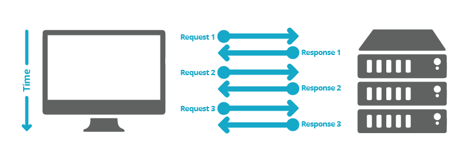

HTTP sta per "Hypertext Transfer Protocol". L'intero World Wide Web utilizza questo protocollo. È stato creato nel primi anni del 1990. Quasi tutto quello che vedi nel browser viene trasmesso al computer su HTTP. Ad esempio, quando hai aperto questa pagina, il tuo browser probabilmente ha inviato oltre 40 richieste HTTP e ricevuto risposte HTTP per ognuna.
Le intestazioni HTTP sono la parte centrale di queste richieste e risposte HTTP e trasportano informazioni sul browser del client, la pagina richiesta, il server e altro ancora.

# Il protocollo HTTP

HTTP

L'HyperText Transfer Protocol (HTTP) è il protocollo di rete sottostante che consente il trasferimento di documenti ipermediali sul Web, in genere tra un browser e un server in modo che gli esseri umani possano leggerli. La versione corrente della specifica HTTP si chiama HTTP / 2.

Come parte di un URI, "http" all'interno di "http://example.com/" è chiamato "schema". Le risorse che utilizzano lo schema "http" vengono in genere trasportate su connessioni non crittografate utilizzando il protocollo HTTP. Lo schema "https" (come in "https://developer.mozilla.org") indica che una risorsa viene trasportata utilizzando il protocollo HTTP, ma su un canale TLS protetto.

HTTP è testuale (tutte le comunicazioni vengono eseguite in testo normale) e senza stato (nessuna comunicazione è a conoscenza delle comunicazioni precedenti). Questa proprietà lo rende ideale per gli esseri umani per leggere documenti (siti web) sul world wide web. Tuttavia, HTTP può anche essere utilizzato come base per servizi Web REST da server a server o richieste AJAX all'interno di siti Web per renderli più dinamici.

Il protocollo **HTTP** funziona mediante un modello richiesta/risposta. Un client invia una richiesta al server, il server risponde. La richiesta può includere al suo interno una serie di funzionalità. Si può chiedere solo di leggere dati, di modificarli, crearli o cancellarli. Tutto ciò viene specificato mediante un campo della richiesta **HTTP** detto metodo. In **REST** si usano per lo più quattro metodi che indicheranno quali di queste operazioni il client starà richiedendo al server: con il metodo **GET** si chiederà solo di leggere dei dati, con il **POST** di crearne di nuovi, con il **PUT** di modificarli e con il **DELETE** di cancellarli.

Ogni richiesta verrà inviata ad un particolare indirizzo web e tale **URL** sarà univoco per la risorsa su cui richiedere l’azione. Supponiamo che il nostro servizio abbia indirizzo web www.mioservizioweb.org/api/ e che condivida articoli ognuno contraddistinto da un numero intero (ad esempio, una chiave nel database).

Il progettista del servizio potrà decidere che:
*  per richiedere la lettura dei dati del prodotto con id pari a 1, si invocherà una richiesta **GET** all’indirizzo www.mioservizioweb.org/api/prodotti/1 
*  per richiedere la lettura dei dati di tutti i prodotti in offerta si invierà una **GET** all’URL www.mioservizioweb.org/api/offerte 
*  per inserire i dati di un nuovo prodotto (ad esempio, un’app ad uso del personale del servizio) si invierà una POST all’indirizzo www.mioservizioweb.org/api/prodotti/nuovo 
*  per modificare i dati del prodotto già esistente con id pari a 1 si invierà una PUT all’indirizzo www.mioservizioweb.org/api/prodotti/1 
*  per cancellare il prodotto con id 1 verrà inviata una **DELETE** a www.mioservizioweb.org/api/prodotti/1 

Come si può immaginare, l’id pari a 1 è a puro titolo di esempio ma in realtà andrà impiegato qualsiasi altro valore valido nel sistema. Questi sono solo alcuni esempi ma rendono l’idea del ruolo che i metodi e gli indirizzi web hanno. Si noti ad esempio che l’indirizzo www.mioservizioweb.org/api/prodotti/1 può servire a vari scopi ma dipende da qual è il metodo che gli associamo.

Altri due punti sono da approfondire: come vengono scambiati i dati e come si determina il significato della risposta del server. Tipicamente nelle **API REST** i dati vengono scambiati in formato JSON, comodo da gestire in ogni linguaggio di programmazione.

Se ad esempio inviamo la **POST** all’indirizzo www.mioservizioweb.org/api/prodotti/nuovo i dati del nuovo prodotto saranno scritti in formato JSON ed inseriti all’interno della richiesta **HTTP**. Anche tutte le risposte del server saranno redatte in formato JSON ed inserite nella risposta **HTTP**.

Un elemento però molto importante è il cosiddetto codice di stato che consiste in un numero intero che il server inserisce nella risposta. Tale numero fornisce già da solo una forte indicazione sull’esito della richiesta. Ti è mai capitato di invocare una pagina web non esistente? Probabilmente avrai ricevuto come risposta il messaggio “404 Page not found”: ecco 404 è proprio un codice di ritorno **HTTP** che indica che la risorsa cercata non è disponibile.

I codici di stato sono composti da tre numeri di cui il primo indica il tenore della risposta:
* se il numero inizia con 2 è buon segno, significa che la richiesta era corretta ed è stata processata con successo;
* se inizia con 4 il client ha eseguito una richiesta non corretta;
* se inizia con 5 si è verificato un errore non per colpa del client, ma internamente al server.

Ecco alcuni dei codici di stato più utilizzati accompagnati ognuno dal messaggio testuale ufficiale:
* **200** “OK”: operazione eseguita con successo; 
* **201** “Created”: successo con conseguente creazione di una nuova risorsa nel servizio. Ad esempio, potrebbe essere la risposta alla POST che inserisce un nuovo prodotto; 
* **400** “Bad Request”: richiesta non formulata correttamente; 
* **401** “Unauthorized”: è necessario eseguire prima un’autenticazione correttamente; 
* **403** “Forbidden”: la richiesta sarebbe corretta ma si è chiesta una risorsa cui è vietato accedere; 
* **404** “Not found”: risorsa non trovata. Immaginiamo ad esempio di inviare una GET all’indirizzo www.mioservizioweb.org/api/prodotti/999 ma il prodotto di id 999 non esiste nel database; 
* **500** “Internal server error”: generico errore interno al server; 
* **501** “Not implemented”: il tipo di richiesta non è stato implementato sul server. 

# HTTP / 1.1 - Il protocollo standardizzato

Parallelamente all'uso un po 'caotico delle diverse implementazioni di HTTP / 1.0, e dal 1995, ben prima della pubblicazione del documento HTTP / 1.0 l'anno successivo, era in corso una corretta standardizzazione. La prima versione standardizzata di HTTP, HTTP / 1.1, è stata pubblicata all'inizio del 1997, solo pochi mesi dopo HTTP / 1.0.

HTTP / 1.1 ha chiarito le ambiguità e introdotto numerosi miglioramenti:

* Una connessione può essere riutilizzata, risparmiando tempo per riaprirla più volte per visualizzare le risorse incorporate nel singolo documento originale recuperato.
* È stato aggiunto il pipelining, che consente di inviare una seconda richiesta prima che la risposta per la prima sia completamente trasmessa, abbassando la latenza della comunicazione.
* Ora sono supportate anche le risposte in blocchi.
* Sono stati introdotti ulteriori meccanismi di controllo della cache.
* La negoziazione del contenuto, inclusa la lingua, la codifica o il tipo, è stata introdotta e consente a un client e un server di concordare il contenuto più adeguato da scambiare.
* Grazie all'intestazione Host, la possibilità di ospitare diversi domini allo stesso indirizzo IP ora consente la colocation del server.

# Più di 15 anni di estensioni

Grazie alla sua estensibilità - creare nuovi header o metodi è facile - e anche se il protocollo HTTP / 1.1 è stato perfezionato su due revisioni, RFC 2616 pubblicata nel giugno 1999 e la serie di RFC 7230-RFC 7235 pubblicata nel giugno 2014 in previsione del rilascio di HTTP / 2, questo protocollo è stato estremamente stabile per più di 15 anni.
Utilizzo di HTTP per trasmissioni protette

Il cambiamento più grande che è accaduto a HTTP è stato fatto già alla fine del 1994. Invece di inviare HTTP su uno stack TCP / IP di base, Netscape Communications ha creato un ulteriore livello di trasmissione crittografato su di esso: SSL. SSL 1.0 non è mai stato rilasciato all'esterno dell'azienda, ma SSL 2.0 e il suo successore SSL 3.0 hanno consentito la creazione di siti Web di e-commerce crittografando e garantendo l'autenticità dei messaggi scambiati tra server e client. SSL è stato inserito nella traccia degli standard e alla fine è diventato TLS, con le versioni 1.0, 1.1, 1.2 e 1.3 che sembravano chiudere con successo le vulnerabilità.

Nello stesso tempo, è emersa la necessità di un livello di trasporto crittografato: il Web ha lasciato la relativa affidabilità di una rete per lo più accademica, in una giungla dove inserzionisti, individui casuali o criminali competono per ottenere quante più informazioni private sulle persone, cercano di impersonarle o anche per sostituire i dati trasmessi con quelli alterati. Man mano che le applicazioni costruite su HTTP sono diventate sempre più potenti, avendo accesso a informazioni sempre più private come rubriche, e-mail o la posizione geografica dell'utente, la necessità di avere TLS è diventata onnipresente anche al di fuori dell'uso dell'e-commerce Astuccio.
Utilizzo di HTTP per applicazioni complesse

La visione originale di Tim Berners-Lee per il Web non era un mezzo di sola lettura. Ha immaginato un Web in cui le persone possono aggiungere e spostare documenti in remoto, una sorta di file system distribuito. Intorno al 1996, HTTP è stato esteso per consentire l'authoring ed è stato creato uno standard chiamato WebDAV. È stato ulteriormente esteso per applicazioni specifiche come CardDAV per gestire le voci della rubrica e CalDAV per gestire i calendari. Ma tutte queste estensioni * DAV avevano un difetto: dovevano essere implementate dai server per essere utilizzate, il che era piuttosto complesso. Il loro utilizzo nei regni Web è rimasto riservato.

Nel 2000, è stato progettato un nuovo modello per l'utilizzo di HTTP: trasferimento di stato rappresentativo (o REST). Le azioni indotte dall'API non erano più veicolate da nuovi metodi HTTP, ma solo accedendo a specifici URI con metodi HTTP / 1.1 di base. Ciò ha permesso a qualsiasi applicazione Web di fornire un'API per consentire il recupero e la modifica dei propri dati senza dover aggiornare i browser o i server: tutto ciò che serve è stato incorporato nei file serviti dai siti Web tramite HTTP / 1.1 standard. Lo svantaggio del modello REST risiede nel fatto che ogni sito web definisce la propria API RESTful non standard e ne ha il controllo totale; a differenza delle estensioni * DAV in cui client e server sono interoperabili. Le API RESTful sono diventate molto comuni negli anni 2010.

Dal 2005, il set di API disponibili per le pagine Web è notevolmente aumentato e molte di queste API hanno creato estensioni, per lo più nuove intestazioni HTTP specifiche, al protocollo HTTP per scopi specifici:

* Eventi inviati dal server, in cui il server può inviare messaggi occasionali al browser.
* WebSocket, un nuovo protocollo che può essere configurato aggiornando una connessione HTTP esistente.

Rilassare il modello di sicurezza del Web

HTTP è indipendente dal modello di sicurezza del Web, la politica della stessa origine. In effetti, l'attuale modello di sicurezza Web è stato sviluppato dopo la creazione di HTTP! Negli anni si è rivelato utile poter essere più indulgenti, consentendo in base a determinati vincoli di revocare alcune delle limitazioni di questa politica. Quanto e quando tali restrizioni vengono rimosse viene trasmesso dal server al client utilizzando un nuovo gruppo di intestazioni HTTP. Questi sono definiti in specifiche come Cross-Origin Resource Sharing (CORS) o Content Security Policy (CSP).

Oltre a queste grandi estensioni, sono state aggiunte numerose altre intestazioni, a volte solo sperimentalmente. Le intestazioni degne di nota sono l'intestazione Do Not Track (DNT) per controllare la privacy, X-Frame-Options o Upgrade-Insecure-Requests, ma ne esistono molti altri.

# HTTP / 2: un protocollo per prestazioni migliori

Nel corso degli anni, le pagine Web sono diventate molto più complesse, fino a diventare applicazioni a sé stanti. Anche la quantità di supporti visivi visualizzati, il volume e le dimensioni degli script che aggiungono interattività sono aumentati: molti più dati vengono trasmessi su un numero significativamente maggiore di richieste HTTP. Le connessioni HTTP / 1.1 richiedono richieste inviate nell'ordine corretto. Teoricamente, potrebbero essere utilizzate diverse connessioni parallele (tipicamente tra 5 e 8), portando notevoli overhead e complessità. Ad esempio, il pipeline HTTP è emerso come un carico di risorse nello sviluppo Web.

Nella prima metà degli anni 2010, Google ha dimostrato un modo alternativo di scambiare dati tra client e server, implementando un protocollo sperimentale SPDY. Questo ha raccolto l'interesse degli sviluppatori che lavorano su browser e server. Definendo un aumento della reattività e risolvendo il problema della duplicazione dei dati trasmessi, SPDY è servito come fondamento del protocollo HTTP / 2.

Il protocollo HTTP / 2 presenta molte differenze principali rispetto alla versione HTTP / 1.1:

* È un protocollo binario piuttosto che testo. Non può più essere letto e creato manualmente. Nonostante questo ostacolo, ora è possibile implementare tecniche di ottimizzazione migliorate.
* È un protocollo multiplex. Le richieste parallele possono essere gestite sulla stessa connessione, rimuovendo l'ordine e bloccando i vincoli del protocollo HTTP / 1.x.
* Comprime le intestazioni. Poiché questi sono spesso simili in un insieme di richieste, ciò rimuove la duplicazione e il sovraccarico dei dati trasmessi.
* Consente a un server di popolare i dati in una cache client, prima che sia richiesto, attraverso un meccanismo chiamato server push.

Ufficialmente standardizzato, nel maggio 2015, HTTP / 2 ha avuto molto successo. A luglio 2016, l'8,7% di tutti i siti Web [1] lo utilizzava già, rappresentando oltre il 68% di tutte le richieste [2]. I siti Web ad alto traffico hanno mostrato l'adozione più rapida, risparmiando considerevolmente sui costi generali di trasferimento dei dati e sui budget successivi.

Questo rapido tasso di adozione era probabile poiché HTTP / 2 non richiede l'adattamento di siti Web e applicazioni: l'utilizzo di HTTP / 1.1 o HTTP / 2 è trasparente per loro. Avere un server aggiornato che comunica con un browser recente è sufficiente per consentirne l'utilizzo: è stato necessario solo un insieme limitato di gruppi per innescare l'adozione e con il rinnovo delle versioni precedenti di browser e server, l'utilizzo è naturalmente aumentato, senza ulteriore Web sforzi degli sviluppatori.