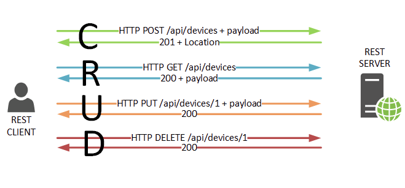

## Servizio Web RESTful: la richiesta

Una **richiesta** di servizio Web RESTful contiene:

* Un **URL endpoint**. Un'applicazione che implementa un'API RESTful definirà uno o più endpoint URL con un **dominio**, una **porta**, un **percorso** e/o una **stringa di query**, ad esempio 
* `https://miodominio/utente/123?formato=json`.

* I **metodi HTTP**. Differenti metodi HTTP possono essere utilizzati su qualsiasi endpoint che esegue il mapping all'applicazione per creare, leggere, aggiornare ed eliminare le operazioni (CRUD):

---

# i principali metodi HTTP

I metodi definiti dallo standard HTTP sono utilizzati per indicare al server come manipolare la risorsa:

* **GET**: richiede una risorsa o una funzionalità
* **POST**: invia al server una nuova risorsa, solitamente per aggiungerla a quelle esistenti e assegnarle un nuovo identificatore
* **PUT** e **PATCH**: specificano al server le modifiche da effettuare su una risorsa esistente.
* **PATCH** Modifica una parte della risorsa già esistente. 
* **DELETE**: richiede la cancellazione di una risorsa.
* **TRACE** Restituisce la richiesta così come il server la riceve, al fine di individuare cambiamenti nelle informazioni durante il percorso svolto.
* **OPTIONS** Mostra una lista dei metodi supportati dal server. 
* **CONNECT** Invia la richiesta tramite un canale SSL per creare un collegamento con un server proxy. 
* **HEAD** Richiede solo l’header della relativa risorsa, per verificarne ad esempio la validità. 

---

### Esempio:

* una richiesta via **GET** `/user/` **ritorna** una lista di utenti registrati
* una richiesta via **POST** `/user/123` **crea** un utente con ID 123 usando i dati nel `body` della richiesta 
* una richiesta via **PUT** `/user/123` **aggiorna** l'utente 123  usando i dati nel `body` della richiesta 
* una richiesta via **GET** `/user/123` **ritorna** i dettagli dell'utente 123
* una richiesta via **DELETE** `/utente/123` **elimina** l'utente 123

* **Intestazioni HTTP**. Informazioni come token di autenticazione o cookie possono essere contenute nell'intestazione della richiesta HTTP.

* **Dati del corpo**. I dati vengono normalmente trasmessi nel corpo HTTP in modo identico agli invii HTML <form> o inviando una singola stringa di dati con codifica JSON.

---

## HTTP Request – la richiesta del client
Campo dell’header|Funzione|Esempio
---|---|---             
Accept|I tipi di contenuto che il client è in grado di elaborare. Se il campo è vuoto significa che è in grado di elaborare tutti i tipi di contenuto|Accept: text/html, application/xml             
Accept-Charset|Quale set di caratteri il client è in grado di mostrare|Accept-Charset: utf-8             
Accept-Encoding|I formati compressi supportati dal client|Accept-Encoding: gzip             
Accept-Language|La lingua desiderata|Accept-Language: it-IT             
Authorization|I dati di autentificazione come ad esempio quelli di login|Basic WjbU7D25zTAlV2tZ7==             
Cache-Control|Le opzioni del meccanismo di caching|Cache-Control: no-cache             
Cookie|I cookie archiviati per questo server|Cookie: $Version=1; Content=23             
Content-Length|Lunghezza del request body (corpo del messaggio|Content-Length: 212             
Content-Type|Il tipo MIME del body rilevante per le richieste POST e PUT|Content-Type: application/x_222-form-urlencoded             
Date|Data e orario della richiesta|Date: Mon, 9 March 2020 09:02:22 GMT             
Expect|Formula quanto ci si aspetta dal server, che solitamente coincide con il ricevimento di una richiesta esaustiva|Expect: 100-continue (il server deve inviare Code 100, se è pronto ad accogliere la richiesta)             
Host|Il nome di dominio del server|Host: esempio.it             
If-Match|Esecuzione condizionata di un’azione in base alla corrispondenza del codice inviato|If-Match: “ft678iujhnjio90’pöl“             
If-Modified-Since|Inviare solamente se il contenuto richiesto è stato modificato successivamente alla data/ora indicata|IF-Modified-Since: Mon 2 Mar 2020 1:00:00 GMT             
If-None-Match|Come sopra, ma specificamente per un ETag (Entity-Tag, vedi sotto|If-None-Match: “cxdrt5678iujhgbvb“             
If-Range|Richiede solo la parte del contenuto che è stata modificata o che manca dalla cache del client|If-Range: Mon 2 Mar 2020 1:00:00 GMT             
If-Unmodified-Since|Il contrario di IF-Modified-Since|If-Unmodified-Since: Mon 2 Mar 2020 1:00:00 GMT             
Max-Forwards|Definisce il limite massimo di quanto spesso può essere inoltrata la risposta del server|Max-Forwards: 12             
Proxy-Authorization|Viene utilizzato per autenticare il client presso un server proxy|Proxy-Authorization: Basic WjbU7D25zTAlV2tZ7==             
Range|Specifica che parte del contenuto viene richiesta|Range: bytes=0-9999             
Referrer|URL della risorsa dalla quale proviene la richiesta (ossia dalla quale è collegata|Referrer: https://esempio.it/index.html             
TE|Accettazione dell’estensione di codifica di trasferimento|TE: gzip, deflate             
User-Agent|Lo user-agent del client (il browser|Mozilla/5.0 (Windows NT 10.0; Win64; x64) AppleWebKit/537.36 (KHTML, like Gecko) Chrome/80.0.3987.132 Safari/537.36             

